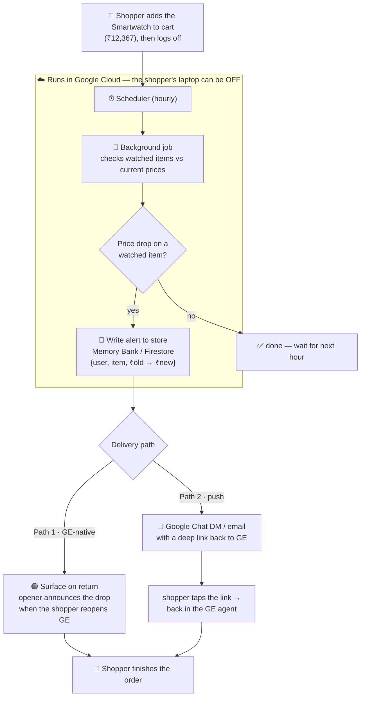

# Context Intelligence — Shopping Companion (Gemini Enterprise agent)

A single Gemini Enterprise companion for **e-commerce**, with a two-tier memory
that behaves like a *persona*. One agent, one flow that uses **both** tiers at
once. Native GE: ADK → Vertex AI Agent Engine → GE chat. Markdown for now (A2UI later).

## The one use case

Ask the shopper's preferences upfront, then guide a 5-step checkout that's
personalized by those preferences and resumable if they leave mid-way.

- **Historical context** (permanent): country → currency (₹ / $), language →
  how we talk, interests → what we recommend & highlight. (Gender & age are not
  collected/stored for the shopper — privacy.)
- **Forward looking** (temporary): the in-progress order — which of the 5 steps
  they're on — surfaced as a "resume where you left off" hint when they return.

## Two memory tiers (one Memory Bank, split by scope)

| Tier | Holds | Lifespan | Scope |
|---|---|---|---|
| **Persona** (permanent) | profile: country, language, interests, currency (no gender/age) | no expiry | `{app_name, user_id, tier:"persona"}` |
| **Task** (temporary) | the in-progress order (step, product, address, payment) | **3-day TTL** | `{app_name, user_id, tier:"task"}` |

One keep-latest record per tier (`profile`, `order`). Task record carries a TTL so
an abandoned cart clears itself. Verified genai-client Memory Bank API; mock fallback.

## The 5-step flow

```
onboarding → capture country/language/interests  (writes PERSONA; no gender/age)
step 1  What would you like to buy?   → recommendations filtered by profile, priced in currency
step 2  Shipping address
step 3  Payment method (cash on delivery / card)
step 4  Order summary → type "confirm"   (dummy — no real payment)
step 5  Done (order id)                   (each step writes the TASK order record)
```

Leave at **step 2 or 3** and return → the opener hints to resume; reply *continue*
or *start over*.

**Repeat orders reuse conveniences.** The last-used shipping address and payment
method are remembered in permanent memory, so on later orders the agent *offers*
them ("ship to your usual address? pay by card as before?") instead of asking blank
— always overridable.

**Shopping for someone else.** A shopper (say, male) can say "I'm looking for my
kid / my wife" → `browse_for` filters the catalogue by *that person's* gender/age
for this browse (transient, in session state — not the permanent profile);
"for myself" switches back, and confirming an order resets to self.

## How it's driven — deterministic data, LLM delivery

The **data** is deterministic; the **delivery** is the LLM. Each turn a `[Context]`
note is injected with the exact facts for the current state — the profile, the
interest-filtered picks with currency-converted prices + ⭐ highlights, the resume
state, or the order summary. The model **narrates that data in its own fresh words,
in the shopper's language**, told to keep every name/price/fact verbatim. So no
message is a fixed template, yet no number is ever invented.

- The model advances the flow via tools (`set_preferences`, `recommend_products`,
  `select_product`, `set_shipping_address`, `set_payment_method`, `confirm_order`).
- Only two user-visible things stay deterministic (system utilities, not shopping
  copy): the **"clear memory"** demo-reset confirmation, and the optional identity
  debug line.
- **Language** is stored and threaded into the delivery instruction, so the whole
  conversation — greeting included — comes back in the shopper's language.

## Demo reset (not a product feature)

Typing **"clear memory"** (or "reset demo") deterministically wipes **both** tiers
and re-arms onboarding, so the flow can be shown from scratch. It's a presenter
utility, not a shopper-facing feature.

## Surrounding awareness — proactive alerts (proposed, for stakeholder review)

The next capability: the agent watches the shopper's world **while they're away**
and proactively alerts them when something relevant changes. For us that's a
**price drop** on an item they care about.

> The shopper left the **Smartwatch (₹12,367)** in their cart on Friday. Over the
> weekend an hourly watcher sees it drop to **₹9,900** and records an alert. On
> Monday the agent greets: *"Good news — the Smartwatch in your cart dropped to
> ₹9,900 while you were away. Want to finish that order?"*

**What's watched** reuses our two-tier memory: the shopper's **interests**
(permanent) + their **in-progress order** (temporary) form the "watch list".

### The one constraint

GE chat is **turn-based** — an agent cannot push an unsolicited bubble into an
idle chat session, and its in-agent send tool needs a live user session. So a
proactive alert is delivered one of two ways:

- **Path 1 — Surface on return (GE-native):** store the alert; the opener announces
  it on the shopper's next visit. No external setup; reuses our opener + memory.
- **Path 2 — True push ("drag you back"):** a background Google Chat DM / email with
  a deep link back to GE. More powerful, but needs a separate Chat app + service
  account + Workspace admin setup.

### Runs in the cloud — the shopper's device can be off

All watching happens **server-side** (Cloud Scheduler + a background job + the alert
store). The laptop/browser is only how the shopper *reads* the alert later; closing
it does not stop the scan.

### Flow



### Recommended phasing

- **Phase 1 — Surface on return** (fast, GE-native, demo-ready): mock price watcher
  + alert record + opener announces drops on return.
- **Phase 2 — True push** (Google Chat / email + deep link) to actively pull the
  shopper back; adds Workspace/admin setup.

## Later

- Localize the deterministic opener into the chosen language.
- Re-add A2UI (product cards, buttons for steps) on top of this memory foundation.
