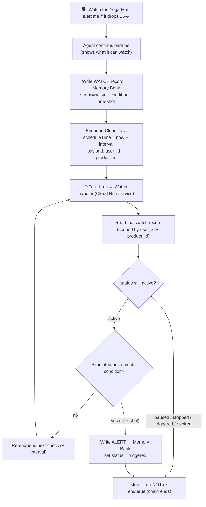
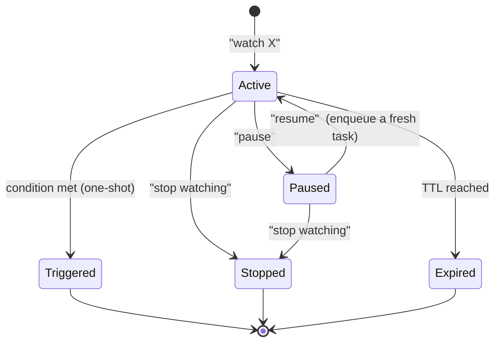

# Chat-driven Watches — long-running tasks run by conversation in Gemini Enterprise

**Status:** design / plan (no code yet) · **Audience:** stakeholder review

## The capability, in one line
The shopper sets up, manages, and cancels **long-running background tasks just by
talking to the GE chat** — *"watch this and tell me if it drops 15%,"* *"what am I
watching?,"* *"pause that,"* *"stop watching the yoga mat."* No console, no forms.
GE chat is the **control plane** for background work.

## Decisions locked (this iteration)

| # | Decision | Choice |
|---|---|---|
| 1 | Price source | **Simulated** (for the demo) |
| 2 | After first alert | **One-shot** — stop watching once it fires |
| 3 | Re-check cadence | **Hourly** in prod (`WATCH_INTERVAL_SECONDS=3600`); **~60 s** for the demo |
| 4 | Notification | **Surface-on-return** now; email/push later |
| 5 | Watchlist store | **Memory Bank** (no second datastore) |
| 6 | Watch expiry (TTL) | **3 days** max (matches the task tier) |

## How the "background job" is triggered — from chat, not a cron

There is **no hourly Cloud Scheduler**. Each watch is its **own self-rescheduling
chain of Cloud Tasks**, started by the chat. Cloud Tasks is built for exactly this —
dynamic, per-item scheduling created by app code, with `scheduleTime`, dedup, and
retries — and it avoids the Cloud Scheduler 500-jobs-per-project cap.



- **Create (chat)** → write the watch record + enqueue the *first* Cloud Task (`now + interval`).
- **Each task** reads its watch, checks status + condition, then **re-enqueues the next
  check** (`now + interval`) — that self-reschedule *is* the background loop. No central scheduler.
- **One-shot:** when the condition is met it writes the alert, sets `status=triggered`,
  and **does not re-enqueue** — the chain ends.

### Cadence & the demo override

"Hourly" is one config value — **`WATCH_INTERVAL_SECONDS` (default 3600)** — used to set
each next task's `scheduleTime`. There's no central clock: each watch reschedules its own
next check, so watches tick on **their own hour, offset by when they were created** (a
watch made at 2:15 checks at 3:15, 4:15, …). Cloud Tasks fires *at or after* `scheduleTime`,
so it's *approximately* hourly — fine for price-watching, not a precise alarm.

**Demo override (we can't wait an hour on stage):** set `WATCH_INTERVAL_SECONDS=60` **and**
have the simulated price **drop on the first check**, so the whole loop — set up → task
fires → alert → return → surface — plays out in **~1–2 minutes**. Prod vs demo is a
one-line env switch, not a code change.

## Lifecycle — a state machine, all driven from chat



| The shopper says… | Tool | Effect |
|---|---|---|
| "watch the Yoga Mat if it drops 15%" | `create_watch` | write record (active) + enqueue first task |
| "pause that" | `pause_watch` | status→paused; next fire won't re-enqueue |
| "resume watching it" | `resume_watch` | status→active + enqueue a fresh task |
| "stop watching the yoga mat" | `stop_watch` | status→stopped (+ purge the pending task) |
| "what am I watching?" | `list_watches` | list the shopper's active watches |
| "change it to 10%" | `update_watch` | modify condition/expiry; next check uses it |

**Pause/stop mechanics:** the record's `status` is the source of truth. A paused/
stopped watch's in-flight task, when it fires, sees the status and **exits without
re-enqueuing** — so the chain dies naturally. `stop_watch` can additionally delete the
pending Cloud Task by name for immediacy.

## The watch record (Memory Bank)

Stored in a **`watch` tier** (or task tier), keyed `watch:{product_id}`, scoped by
`user_id` — so the Cloud Task handler, given `user_id + product_id` in its payload,
reads exactly one record. No cross-user query needed → Memory Bank is a clean fit.

```
key: "watch:<product_id>"
user_id, product_id, product_name, base_price,
condition: { type: "pct_drop" | "target_price" | "any_drop" | "back_in_stock",
             params: { pct: 15 } },
status: active | paused | stopped | triggered | expired,
mode: "one_shot",                 # locked decision #2
interval_seconds: 3600,           # decision #3 (prod hourly; demo override 60)
expires_at,                       # TTL 3 days (decision #6; matches task tier)
notify: "surface_on_return",      # locked decision #4
created_at, last_checked_at, pending_task_name
```

## Conditions the shopper can ask for

| Condition | Phrasing | params |
|---|---|---|
| **% price drop** | "if it drops 15%" | `pct: 15` |
| **Target price** | "when it's under ₹10,000" | `target: 10000` |
| **Any drop** | "if the price goes down at all" | — |
| **Back in stock** | "when it's available again" | — |

This fixed set powers the proactive guidance below. (Prices are **simulated** for the
demo — the handler fakes a drop; a real deployment swaps in a price feed.)

## Proactive guidance — show capability, guide deviations

When the shopper asks to watch something, the agent **confirms and shows the menu**
(a fixed capability spec, conveyed naturally — deterministic data, LLM delivery):

> *"👍 I'll watch the **Yoga Mat (₹3,237)**. I can alert you on a **% drop** (e.g. 15%),
> a **target price** (e.g. under ₹2,500), **any drop**, or **back in stock** — and I'll
> tell you **when you next return**. Which would you like?"*

If the shopper asks for something unsupported (*"watch the competitor's stock levels"*),
the agent explains what it **can** watch and steers back — it never sets up an
un-actionable watch. This keeps the user inside the supported parameters.

## Guardrails

- **Max watches per user** — **10** (cost + abuse control).
- **Dedup** — one watch per (user, product, condition); re-asking updates it.
- **Min interval** — floor the cadence so the price source isn't hammered.
- **Expiry TTL** — abandoned watches auto-expire after **3 days** (matches the task tier).
- **Auth** — agent service account: Cloud Tasks *enqueuer* + Memory Bank write; handler:
  Memory Bank read/update + alert write.

## What this reuses / adds / removes

- **Reuses:** alert-writing + **surface-on-return** (already built), price/`scale_price`
  logic, the deterministic-data + LLM-delivery style, clear/lifecycle patterns.
- **Adds:** the watch record in Memory Bank, 6 watch tools
  (`create/pause/resume/stop/list/update`), and a **Cloud Tasks handler** (a small Cloud
  Run *service* — the HTTP endpoint tasks call), plus enqueue/delete logic.
- **Removes:** the hourly Cloud Scheduler → Cloud Run **Job** watcher. Its price-check
  code moves into the task handler; the fixed cron is replaced by per-watch Cloud Tasks.

## Storage rationale (why Memory Bank, not Firestore)

- Each Cloud Task carries `user_id + product_id`, so the handler reads **one** watch
  record by scope — no cross-user query, which is where Firestore would have helped.
- `list_watches` is per-user (the current shopper), also a simple scoped read.
- Keeps alerts + watches in the **same** store the agent already uses for
  surface-on-return → one datastore, no new service.
- *(Firestore has a free tier so cost isn't the blocker; it's just unnecessary here. If
  a future feature needs a global cross-user query over all watches, revisit Firestore.)*

## Phasing

- **Phase 1 (this design):** chat-created one-shot hourly watches, simulated price,
  surface-on-return, full lifecycle (create/pause/resume/stop/list/update), Memory Bank.
- **Phase 2 (later):** email / Google Chat **push** notification (the "drag you back"
  channel); real price feed; continuous (non-one-shot) watches if wanted.

## Demo narrative (the GE-chat-runs-long-tasks showcase)
1. *"Watch the Yoga Mat and tell me if it drops 15%."* → agent shows options, confirms, sets it up.
2. *"What am I watching?"* → lists the active watch.
3. *(background: with the demo interval `WATCH_INTERVAL_SECONDS=60`, a Cloud Task fires within ~1 min, the simulated price drops 15% on the first check, alert written, watch marked triggered — one-shot)*
4. *"Hi"* on return → agent leads with the price drop.
5. *"Stop watching the yoga mat."* → terminated (were it still active).

Every step is natural conversation — **that** is the capability we're showing: GE chat
setting up and running real long-running background tasks, hands-free.

## Open items to confirm before build
- Tool naming / whether all 6 lifecycle verbs ship in Phase 1 or a subset.

_(Resolved: TTL **3 days**; max watches/user **10**; demo interval **60 s** with the
simulated drop on the **first** check.)_
